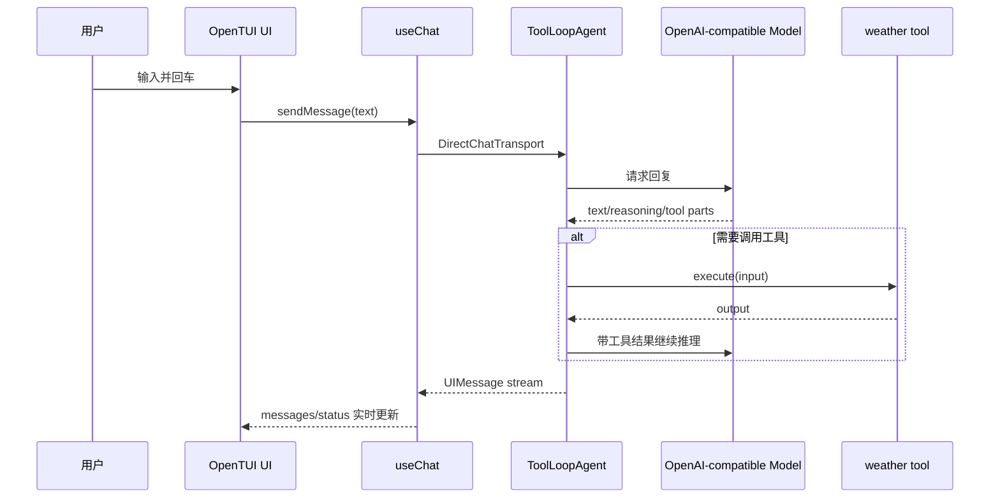

# 1/TUIAgent: Terminal Chat Agent

这是一个基于 `Vercel AI SDK v6 + OpenTUI` 的终端聊天 Agent 示例，重点演示 **TUI 场景下的 message.parts 渲染与交互细节**。

## 核心特性

1. **分角色排版**: `You / Assistant` 使用不同视觉样式，提升终端可读性。
2. **Parts 细粒度渲染**: 按 `text / reasoning / tool` 分别渲染，避免信息混杂。
3. **Tool 状态可视化**: 展示工具执行中、成功、失败、拒绝等状态。
4. **多层 Loading Indicators**:
   - 整体请求中：`Thinking...` spinner
   - Tool 执行中：Tool 卡片内 spinner + 高亮边框
   - 文本流式输出中：末尾 streaming cursor
5. **输入体验优化**: 聚焦态高亮、可见光标、发送后自动清空。

## 快速开始

本项目使用 `bun` 进行依赖管理和运行。

### 前置要求

- [Bun](https://bun.sh)
- 一个兼容 OpenAI API 的本地服务（例如 `1/OpenAI` 中启动的服务），运行在 `http://localhost:8000`。

### 运行

在 `1/TUIAgent` 目录下执行：

```bash
bun install
bun run dev
```

可选：运行类型检查

```bash
bun run typecheck
```

默认会使用 `model.ts` 中的本地 OpenAI 兼容端点。

如果你要切换到其他模型服务，直接修改 `model.ts` 里的 `baseURL` / `apiKey` 即可。

## 目录结构

```text
1/TUIAgent
├─ index.tsx
├─ model.ts
├─ src/
│  └─ components/
│     ├─ ChatInput.tsx
│     ├─ MessageItem.tsx
│     ├─ Spinner.tsx
│     └─ ToolCallPart.tsx
├─ package.json
└─ tsconfig.json
```

## 学习重点

### 1) `ToolLoopAgent` + `useChat`

- `ToolLoopAgent` 负责模型与工具调用循环。
- `useChat` 负责消息状态、流式更新和发送动作。
- 通过 `DirectChatTransport` 将 TUI 与 Agent 直接串联。

### 2) `message.parts` 渲染策略

- `text`: assistant 使用 `<markdown>` 流式渲染；user 使用纯文本。
- `reasoning`: 使用低对比色单独展示，避免干扰主答复。
- `tool`: 使用 `ToolCallPart` 卡片展示工具名、输入、输出与错误。

### 3) 组件拆分

- `MessageItem.tsx`: 单条消息与 parts 渲染编排。
- `ToolCallPart.tsx`: 工具调用卡片与状态图标。
- `Spinner.tsx`: 通用 spinner 与 `useSpinner`。
- `ChatInput.tsx`: 输入区焦点、光标与发送逻辑。

## 运行数据流



## 延伸阅读

- [Vercel AI SDK](https://ai-sdk.vercel.com/)
- [OpenTUI](https://github.com/sst/opentui)
