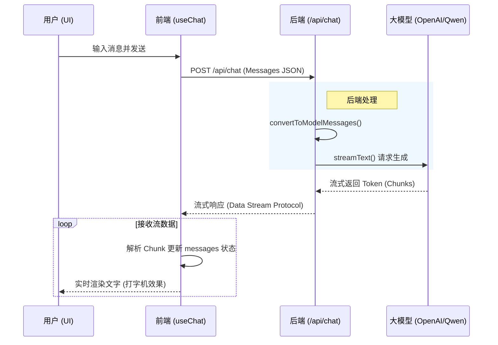

# 1/VercelAIElements: AI SDK UI Components

这是一个基于 React 和 Tailwind CSS 的前端项目，展示了如何使用 Vercel AI SDK UI (`@ai-sdk/react`) 配合自定义 UI 组件构建现代化的 Chat 界面。

## 快速开始

本项目使用 `bun` 进行管理。

### 前置要求

- [Bun](https://bun.sh)
- 一个兼容 OpenAI API 的本地服务（例如 `1/OpenAI` 中启动的服务），运行在 `http://localhost:8000`。

### 运行

在 `1/VercelAIElements` 目录下运行：

```bash
bun install
bun dev
```

## 交互方式

- 浏览器打开 `http://localhost:5173` (默认端口)。
- 在输入框发送消息。
- 界面展示了流式输出、消息重试 (Regenerate) 和复制功能。

## 学习重点

### 0. `streamText` & `convertToModelMessages`

在 `src/index.ts` 中，我们使用了 Vercel AI SDK Core 的核心 API 来处理后端逻辑：

```typescript
const result = streamText({
  system: `You are a helpful assistant.`,
  model: openai.chat("Qwen/Qwen2.5-3B-Instruct"),
  messages: await convertToModelMessages(messages),
});

return result.toUIMessageStreamResponse({ ... });
```

- **`convertToModelMessages`**: 前端传来的 `messages` 是 `UIMessage[]` 格式。这个辅助函数将其转换为大模型能理解的通用消息格式（Core Message），自动处理了文本、附件等内容的转换。
- **`streamText`**: 这是 AI SDK 的核心函数，用于调用模型并返回流式响应。它统一了不同模型提供商（如 OpenAI、Anthropic、本地模型等）的接口。
- **`toUIMessageStreamResponse`**: 将生成的流转换为前端 `useChat` hook 可消费的特殊数据流格式，支持流式传输文本、工具调用、推理过程（Reasoning）等。

### 1. `useChat` Hook

核心逻辑由 `@ai-sdk/react` 提供的 `useChat` 驱动。它负责管理消息状态 (`messages`)、处理流式响应 (`status`) 以及发送消息 (`sendMessage`)。

```typescript
const { messages, sendMessage, status, regenerate } = useChat({
  transport: new DefaultChatTransport({
    api: "/api/chat",
  }),
});
```

### 2. 数据流 (Data Flow)

当用户在界面上发送一条消息时，数据在前端和后端之间流转的完整过程如下：

1. **用户输入**: 用户点击发送，`PromptInput` 调用 `useChat` 提供的 `sendMessage` 方法。
2. **发送请求**: `useChat` 将当前对话历史（`messages`）打包，向 `/api/chat` 发送 POST 请求。
3. **后端处理**:
    - Bun 服务器接收请求。
    - 使用 `convertToModelMessages` 将前端消息格式转换为 LLM 可理解的格式。
    - 调用 `streamText` 向模型（如 Qwen）发起请求。
4. **流式响应**: 模型生成的 Token 被实时捕获，并通过 `toUIMessageStreamResponse` 封装成特定格式的数据流（包含文本增量、工具调用等）返回给前端。
5. **前端渲染**: `useChat` 自动解析这个流，实时更新 `messages` 状态。React 组件监听到状态变化，将新的内容逐字渲染在屏幕上。

以下是该过程的序列图：



### 3. 组件化开发

项目直接使用了 [Vercel 的 ai-elements](https://elements.ai-sdk.dev/)，通过 `npx ai-elements@latest` 拉取所有的ai-elements组件和其依赖。基于 `shadcn/ui`。

项目中的 `src/components/ai-elements` 和 `src/components/ui` 以及 `package.json` 中的大多数依赖都是 `npx ai-elements@latest` 自动生成（或添加）的，无需过度关注。

项目展示了高度组件化的 AI 界面构建方式，包括：

- `Conversation`: 对话容器
- `Message`: 消息气泡
- `PromptInput`: 输入区域

这些组件封装了复杂的 UI 逻辑，使得业务代码（`App.tsx`）保持整洁。所有的这些组件都是来自 [Vercel 的 ai-elements](https://elements.ai-sdk.dev/) 的，没有任何一个需要自己开发。

### 4. 交互细节

演示了如何处理常见的 AI 交互模式：

- **流式状态**: 根据 `status === 'streaming'` 禁用提交按钮。
- **消息操作**: 仅在助手消息（`assistant`）且是最后一条时显示“重试”和“复制”按钮。

## 延伸阅读

前往 [Vercel AI SDK](https://ai-sdk.vercel.com/) 和 [Vercel AI Elements](https://elements.ai-sdk.dev/) 了解更多 Vercel 在 AI 上的建设，大部分建设已经逐渐成为主流选择。
