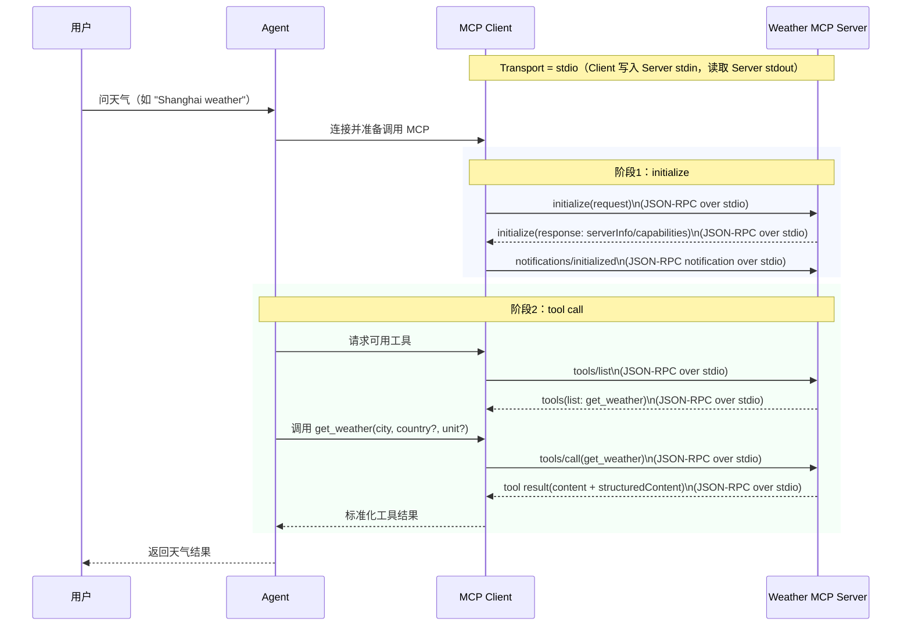

# 2/WeatherMCPServer: Weather MCP (stdio)

这是一个基于 `@modelcontextprotocol/sdk` 的天气 MCP Server 示例，使用 `stdio` 传输、`bun` 运行，对外提供一个简洁的天气查询工具 `get_weather`。

## 核心特性

1. **stdio MCP Server**: 可被支持 MCP 的客户端直接拉起并调用。
2. **单工具最小实现**: 聚焦一个工具 `get_weather`，便于理解 MCP Tool 的输入输出约定。
3. **结构化输出**: 同时返回可读文本和 `structuredContent`，方便客户端展示与后处理。
4. **轻量实现**: 保持实现简洁，便于快速接入和联调 MCP 客户端。

## 快速开始

在 `2/WeatherMCPServer` 目录下执行：

```bash
bun install
bun run start
```

开发模式（文件变更自动重启）：

```bash
bun run dev
```

启动成功后会看到日志：`weather-mcp server started on stdio`

## MCP Server 信息

- `name`: `weather-mcp`
- `version`: `1.0.0`
- `title`: `Weather MCP`
- `instructions`: 提示客户端通过 `get_weather` 获取天气快照，并通过 `unit` 控制温度单位

## 工具说明

### `get_weather`

- 入参：
  - `city`（必填）：城市名，例如 `Shanghai`
  - `country`（可选）：国家或地区
  - `unit`（可选）：`celsius` 或 `fahrenheit`，默认 `celsius`
- 输出字段：
  - `city`, `country`
  - `condition`（`sunny/cloudy/rainy/windy/snowy`）
  - `temperature`, `unit`
  - `humidity`, `windKph`
  - `note`

## 目录结构

```text
2/WeatherMCPServer
├─ src/
│  └─ index.ts
├─ package.json
├─ tsconfig.json
└─ README.md
```

## 与 MCP 客户端集成（示例）

核心思路是通过 `bun` 启动该 server，并使用 `stdio` 作为传输层。

示例命令：

```bash
bun run /absolute/path/to/2/WeatherMCPServer/src/index.ts
```

客户端配置中通常可映射为：

- `command`: `bun`
- `args`: `run`, `/absolute/path/to/2/WeatherMCPServer/src/index.ts`

## 数据流转（Agent / MCP Client / MCP Server）

下面用两个阶段说明典型交互链路：

1. `initialize` 阶段：客户端与服务端完成能力协商（协议版本、capabilities、server info）。
2. `tool call` 阶段：Agent 先让 MCP Client `list_tools`，再发起 `tools/call(get_weather)`，最终把结果返回给用户。



## 说明

- 当前示例为教学用途，优先展示 MCP Tool 的输入输出与接入方式。
- 若要接入外部天气服务，可在 `src/index.ts` 中替换数据来源并保留当前 tool schema。

## 延伸阅读

1. MCP 不仅可以提供工具（Tools），还可以提供 Prompts、Resources、Events，甚至支持 Sampling 等能力。可以从下面几个入口继续看：
   - MCP 官方文档首页：<https://modelcontextprotocol.io/introduction>
   - MCP 规范（Specification）：<https://spec.modelcontextprotocol.io>
   - TypeScript SDK 文档（Server 能力总览）：<https://github.com/modelcontextprotocol/typescript-sdk/blob/main/docs/server.md>
   - TypeScript SDK 能力文档（Sampling / Elicitation / Tasks）：<https://github.com/modelcontextprotocol/typescript-sdk/blob/main/docs/capabilities.md>
2. MCP 也可以使用不同于 `stdio` 的传输方式，例如 Streamable HTTP（推荐）以及兼容场景下的 SSE。可参考：
   - MCP Transports 概览：<https://modelcontextprotocol.io/docs/concepts/transports>
   - TypeScript SDK Server 文档（stdio / Streamable HTTP / SSE）：<https://github.com/modelcontextprotocol/typescript-sdk/blob/main/docs/server.md#transports>
3. HTTP 版本的 MCP Server 可以接入复杂多样的鉴权方式（如 Bearer Token、OAuth 2.0、client credentials、JWT 等），并允许使用 session 机制来支持有状态场景（如会话上下文、订阅流、任务恢复）。可参考：
   - MCP Authorization 规范：<https://modelcontextprotocol.io/specification/draft/basic/authorization>
   - MCP Transports 与 Session 概览：<https://modelcontextprotocol.io/docs/concepts/transports>
   - TypeScript SDK Server 文档（OAuth / 认证相关）：<https://github.com/modelcontextprotocol/typescript-sdk/blob/main/docs/server.md#authentication-and-authorization>
   - TypeScript SDK Client 文档（OAuth 客户端示例）：<https://github.com/modelcontextprotocol/typescript-sdk/blob/main/docs/client.md#oauth>
